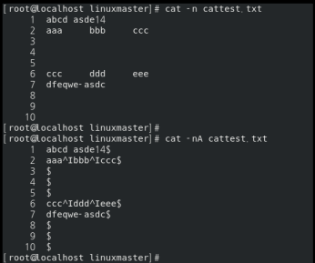

CH.2 리눅스 시스템의 이해
1. 리눅스와 하드웨어
    1-1. 하드웨어의 이해
    1-2. 하드웨어의 선택
    
    # RAID(Redundant Array of Independent Disks) 분류 2014(2) 2015(1) 2015(2) 2016(1) 2016(2) 2017(1) 2017(2) 2018(1)
    - RAID 0 : 스트라이핑 기능(분배 기록) 사용. 빠른 I/O 성능, 고장 대비 능력 X
    - RAID 1 : 두 개 이상의 디스크를 미러링을 통해 하나의 디스크처럼 사용.
    - RAID 2 : ECC(에러 검출 기능) 탑재
    - RAID 3 : 하나의 디스크를 에러검출을 위한 패리티 정보 저장용으로 사용하고 나머지 디스크에 데이터를 균등하게 분산 저장
    - RAID 4 : RAID 3 방식과 같지만 블록 단위로 분산 저장
    - RAID 5 : 하나의 디스크에 패리티 정보를 저장하지 않고 분산 저장 (회전식 패리티 어레이)
    - RAID 6 : 하나의 패리티 정보를 두개의 디스크에 분산 저장. 쓰기 능력은 저하될 수 있지만 고장 대비 능력이 매우 높음. 두 개의 오류까지 검출 가능.
    - RAID 7 : 실시간 운영체계를 사용
    - RAID 0+1 : 최소 4개 이상의 디스크를 2개씩 스트라이핑으로 묶고(RAID 0) 미러링으로 결합(RAID 1)한 방식
    - RAID 10 : 두 개의 디스크를 미러링으로 묶고(RAID 1) 스트라이핑(RAID 0)으로 결합한 방식

    # SCSI(Small Computer System Interface) 2014(1)
    - 주변기기를 연결하기 위한 표준 인터페이스
    - 고성능이고 호환성/확장성이 뛰어남.

    2. 리눅스의 구조
    2-1. 부트 매니저
    # 리눅스 부트로더 LILO/GRUB
        - 부트로더: OS가 시동되기 이전에 미리 실행되면서 커널이 올바르게 시동되기 위해 필요한 모든 관련 작업을 마무리하고 최종적으로 OS를 시동하기 위한 프로그램

    • LILO(Linux Loade)
        - 리눅스 배포판의 표준 부트로더
        - 오래된 리눅스용 기본 부트로더
        - 대화형 명령어 인터페이스가 없고, 네트워크 부팅 지원하지 않음.

    • GRUB(Grand Unified Boot loader)
        - 리눅스, vSTA, DOS 및 기타 OS에서 사용할 수 있는 부트로더
        - 새로운 기본 부트로더
        - 대화형 명령어 인터페이스가 있고, 네트워크 부팅 지원함.
        - 부트로더에 문제가 있을 시 grub-install 명령어를 사용하여 복구 

    2-2 디렉터리 구조 및 디렉터리 별 기능
    # 디렉터리 분류
        • /bin: 기본 명령어들이 저장
        • /sbin: 시스템 관리를 위한 명령어들이 저장
        • /etc: 환경설정에 연관된 파일들과 디렉터리들이 저장
            - /etc/rc.d: 시스템의 부팅과 런 레벨 관련 스크립트들이 저장
            - /etc/inittab: init을 설정하는 파일
            - /etc/issue: 로그인을 위한 프롬프트가 뜨기 전에 출력되는 메시지를 설정하는 파일
            - /etc/issue.net: issue 파일과 기능은 같으나, 원격지 상에서 접속(telnet 등)할 경우에 출려되는 메시지 설정
            - /etc/motd: 로그인 성공 후 쉘이 뜨기 전에 출력되는 메시지를 설정하는 파일
            - /etc/nologin.txt: 사용자의 쉘이 /sbin/nologin으로 지정되어 있을 때, 로그인 거부 메시지를 설정하는 파일
        • /boot: 리눅스 부트에 필요한 부팅 지원 파일들이 저장
        • /mnt: 외부장치를 마운트하기 위해 제공되는 디렉터리
        • /usr: 각종 응용프로그램들이 설치되는 디렉터리
            - /usr/bin: /bin 디렉터리에 없는 다양한 실행파일이 저장
            - /usr/src: 시스템에서 사용하는 각종 프로그램들의 컴파일되지 않은 소스파일들이 저장
        • /lib: 각종 라이브러리들이 저장
        • /dev: 장치 드라이버들이 저장되는 가상 디렉터리
            - /dev/console: 시스템의 콘솔
            - /dev/null: 폐기를 위한 디렉터리. 이 디렉터리로 파일이나 데이터를 보내면 폐기된다
            EX) #find/-perm-4000 2>/dev/null: 명령어 실행결과에서 오류메시지를 출력하지 않고 폐기
        • /proc: 시스템의 각종 프로세서, 프로그램 정보, 하드웨어적인 정보들이 저장되는 가상 디렉터리
            - /proc/partitions: 파티션 정보 파일
        • /var: 시스템에서 사용되는 동적인 파일들이 저장
            - /var/log: 프로그램들의 로그 파일들이 저장
        
    2-3. 부팅과 셧다운
    # 관련 명령어
        • halt: 시스템 종료.[-f] 옵션으로 강제 종료 가능
        • reboot: 시스템 재부팅.[-f] 옵션으로 강제 재부팅 가능
        • shutdown
            -[-h]: 종료 옵션    EX) #shutdown -h now: 즉시 종료
            -[-r]: 재부팅 옵션  EX) #shutdown -r +30: 30분 후에 재부팅
            -[-c]: 명령 취소
            -[-k]: 실제로 종료하지 않고 종료하겠다는 메시지만 사용자들에게 보냄
        • init: 런레벨(Run Level)을 변경하는 명렁어 
            EX) #init 0: 시스템 종료
            EX) #init 6: 시스템 재부팅
        • ntsysv 명령어
            - 부팅할 때 각 런레벨에 따라 자동으로 실행시킬 서비스를 설정하는 명령어
        
    # 부팅과정
    1.BIOS(Basic Input Output System) 실행, POST(Power On Self Test) 수행
    2.MVR(Master Boot Record) 읽고, 부트로더(LILO/GRUB) 로드
    3.커널 이미지 로드
    4.각 장치 드라이버 초기화, 파일 시스템 검사, init 프로세스 호출
    5./etc/inittab 파일 참조
        - 런레벨 관련 파일
    6./etc/rc.d/rc.sysinit 스크립트 실행
        -/etc/init/rcS.conf 파일 적용: 시스템 초기화 관련 설정 파일.rc.sysinit 스크립트를 실행
    7.해당 런레벨에 맞는 /etc/rc.d/rc#/d/* 스크립트 실행
        -etc/init/rc.conf 파일 적용: 런레벨별로 진행되는 내용이 설정된 파일.rc#.d/* 스크립트 실행
    8./etc/rc.d/rc.local 스크립트 실행
        - 부팅 시 필요한 서비스를 이 스크립트 안에 등록
    9.로그인 프롬프트 출력

    2-4. 파일시스템의 이해
    # 파일시스템 종류
    • ext3
        - ext2에서 fsck의 단점을 보완하기 위해 저널링 기술을 도입한 파일시스템
        - 저널링(Journallng) 기술: 데이터를 디스크에 쓰기 전에 로그에 데이터를 남겨 fsck보다 빠르고 안정적인 복구 기능을 제공하는 기술
        - 최대 볼륨크기 2TB ~ 16TB / 최대 파일크기 16GB ~ 2TB 지원 / 하위 디렉터리 수: 32000개
    
    • ext4
        - ext3의 기능을 향상시킨 파일시스템
        - ext2/ext3 파일시스템과 호환 가능
        - 지연된 할당: 데이터가 디스크에 쓰여지기 전까지 블록 할당을 지연시켜 향상된 블록 할당이 가능
        - 최대 볼륨크기 1EB/ 최대파일크기 16TB 지원/ 하위 디렉터리 수: 64000개
    
    • XFS
        - 고성능 64비트 저널링 파일 시스템
        - 리눅스 커널 2.4.20 버전에서 커널로 포팅되었다

    3. X 윈도
    3-1. X 윈도의 개념 및 특징
    # X 윈도 시스템의 4가지 요소
        • 서버/클라이언트
        • X 프로토콜
            - X 서버와 X 클라이언트의 상호 작용을 위한 메시지 교환에서 메시지 형태와 사용법을 X 프로토콜이라 함.
        • Xlib
            - C언어로 작성된 X 클라이언트 라이브러리
            - 저수준 인터페이스이기 때문에 상위 라이브러리인 Xtoolkit을 사용한다
            - X.org에서는 Xlib 대신 XCB를 사용하고 있다
        • Xtoolkit
            - 상위 라이브러리
            - Qt, GTX 등이 있음

    # XFree86 와 X.org
        - 리눅스/유닉스 계열의 X 윈도 시스템 프로젝트
        - XFree86의 라이선스 논란 이후에 X.org 서버가 사용되고 있다
        - 현재 대부분의 리눅스 배포판은 X.org를 사용한다
    
    # 관련 명령어
        • startx
            - X 윈도 구동 명령어    EX)#startx--:1 두 번째 윈도 터미널에 X 윈도를 구동
            - 명령어 오류 발생시 Xcongigurator을 실행하여 설정
        • xhost
            - X 윈도 서버의 호스트 접근 제어를 하기 위한 명령어
        • xauth
            - X 서버 연결에 사용되는 권한 부여 정보(.Xauthority 파일의 MIT-MAGIC-COOKIEs 값) 편집/출력 명령어
            EX) # xauth list $DISPLAY : 현재 MIT-MAGIC-COOKIEs 값을 출력
            # xauth add $DISPLAY . ‘쿠키 값’ : .Xauthority 파일에 MIT-MAGIC-COOKIEs 값을 추가
    
    # X 윈도 데스크톱 환경 종류
        • KDE(K Desktop Environment)
            - Qt 라이브러리를 사용
        • GNOME(GNU Network Object Model Environment)
            - GTK 라이브러리를 사용
            - GNU 프로젝트의 일부이며, 리눅스 계열에서 가장 많이 쓰인다

    # 디스플레이 매니저
        - X 윈도 상에서 작동하는 프로그램
        - 로그인 창을 통해 사용자 인증을 수행한다

    # X 윈도 소프트웨어
        • Evince(에빈스)
            - 문서 뷰어 프로그램
            - 지원 파일 형식: PDF, PS, XPS, TIFF 등
        • LibreOffic(리브레 오피스)
            - 오피스 프로그램
            - MS Office 등의 오피스 프로그램과 호환
            - Writer(워드), Calc(스프레드시트/엑셀), Impress(프레젠테이션/파워포인트),Base(DB관리)등의 프로그램 지원
        • Cheese Photo Booth(치즈): 웹캠 프로그램
        • Rhythmbox(리듬박스): 오디오 플레이어
        • Shotwell(샷웰): 사진 관리 프로그램

    4. 쉘
    4-1. 쉘의 이해
    # 쉘 기능 및 종류
        • 쉘(Shell): 명령어 해석기, 커널과 직접적으로 연결되어 해석 결과를 커널로 보냄
        • 본 쉘(Bourne Shell, sh)
            - 스티븐 본이 개발하였으며, 강력한 명령 프로그래밍 언어 기능을 갖추고 있음
            - 상호 대화형(Interactive) 방식을 사용하지 않음
        • C 쉘(csh)
            - 빌 조이가 개발하였으며, C 언어와 유사한 언어를 사용
            - 상호 대화형 방식으로 구성
        • 콘 쉘(Korn Shell,ksh)
            - 데이브 콘이 개발하였으며, 사용하기 편리하고 기능이 탁월하다
            - 명령행 편집 기능을 제공
        • 배시(Bourne-Again Shell, bash)
            - 브라이언 폭스가 개발하였으며, sh 호환의 명령어 해석기
            - 처음 로그인 했을 때 디폴트로 주어지는 쉘이다.

    # 특수문자
        • $: 변수 접근 기호     EX) $value : 변수 value     $SHELL : 환경변수 SHELL. 사용하는 쉘의 위치가 저장되어 있음 
        • \ : 이 문자 뒤에 나오는 특수문자는 문자로 처리된다. (escape 처리된다고 말한다.)
            EX) # echo \$a → $a 문자 출력       # echo $a → 변수 a의 값 출력
        • #: 주석 처리 문자
        • *: 0개 이상의 문자가 일치함을 나타내는 치환 문자
            EX) a*e : apple, ace 등의 문자가 포함됨
        • ?: 1개의 문자가 일치함을 나타내는 치환 문자
            EX) a?e : ace, are, age 등의 문자가 포함됨.
        • “ (큰따옴표) : `(역따옴표), \ 를 제외한 모든 특수문자를 일반문자로 처리
            EX) # echo “$HOME, $USER” → 환경변수 HOME과 USER의 값을 출력한다.   
            (실행결과 예) /home/fedora, fedorauser
        • ‘ (작은따옴표) : 모든 특수문자를 일반문자로 처리
            EX) # echo ‘$HOME, $USER’ → $HOME, $USER 을 그대로 출력
        • ` (역따옴표) : 역따옴표로 감싼 문자열을 명령어로 해석
            EX) # echo `pwd` → pwd 를 명령어로 해석하여 pwd 명령의 결과를 출력

    4-2. 쉘 프로그래밍
    # 프로그래밍에 쓰이는 명령어 정리
        • echo 명령어: 인수로 지정된 문자열이나 환경변수를 출력
            -[-n]: 개행없이 출력
        • read 명령어: 인수로 지정된 변수에 값을 입력 받음.
        • let / expr 명령어: 수식 연산을 위한 명령어

    # 특수변수/ 매개변수 확장
        -$?: 마지막으로 실행된 프로세스의 상태값을 나타냄
        -$0: 현재 스크립트의 이름
        -$1: 첫번쨰 인수
        -${#변수}: 문자열의 길이  EX) # echo ${#value} → value=”333” 이라면 3이 출력
        -${변수:위치} : 위치부터 문자열 출력 (0부터 시작) EX) # echo ${value:3} → value=”string” 이라면 ing 출력

    # 열가지 함수들
        •[조건문] if 문
        1. 형식: if[조건] then
                    명령어
                 elif[조건] then
                    명령어
                 else
                    명령어
                 fi
        2.조건문 작성법
        - [ A -lt B ] : A가 B보다 작다
        - [ A -eq B ] : A와 B가 같다
        - [ A -qt B ] : A가 B보다 크다
        - [ A –qe B ] : A가 B보다 크거나 같다
        - [ A -le B ] : A가 B보다 작거나 같다
        - [ A -ne B ] : A가 B와 다르다

        •[조건문] case 문
            -형식: case 변수 in
                    패턴1) 명령어;;
                    패턴2) 명령어;;
                    ...
                    *)명령어;;
                    esac
        - "*)" 은 아무 패턴과 일치하지 않을 때 수행되어지는 구간이다

        • [반복문] for 문
            - 형식 : for 변수 in 값
                     do
                        명령어
                     done
 
        • [반복문] while 문
            - 형식 : while [ 조건 ]
                     do
                        명령어
                     done
 
        • [반복문] until 문
            - 형식 : until [ 조건 ]
                     do
                        명령어
                     done

    4-3. 책에 없는 내장 명령어와 기타 내용
    # 출력 명령어
    • cut 명령어: 파일에서 필드를 뽑아내서 출력
        -[-f]: 잘라낼 필드를 지정
        -[-d]: 필드를 구분하는 문자를 지정
        -[-c]: 잘라낼 곳의 글자 위치를 지정
            EX) # cut -f 1,3,4 -d : /etc/passwd → /etc/passwd 파일에서 필드를 :로 구분하여 1,3,4번째 필드를 출력
            # cut -c 1-10 /etc/passwd → /etc/passwd 파일에서 첫번째 문자부터 10번째 문자 까지만 출력

    • more/less 명령어 : 내용이 많은 파일을 출력할 때 사용하는 명령어
        - [-f] / [SpaceBar] : 한 페이지 뒤로 이동
        - [-b] : 한 페이지 앞으로 이동

    • tail 명령어 : 파일의 내용을 뒷부분부터 출력
        - [-n] : 지정한 줄만큼 출력

    • head 명령어 : 파일의 내용을 앞부분부터 출력

    • cat 명령어 : 파일의 내용을 화면에 출력 2015(2)
        - [-n] : 행 번호를 붙여서 출력
        - [-b] : 행 번호를 붙여서 출력하되, 비어있는 행은 제외
        - [-s] : 비어있는 2개 이상의 빈 행은 하나의 행으로 출력
        - [-v] : 탭 문자와 End 문자를 제외한 제어 문자를 ‘^’로 출력
        - [-T] : 탭(tab) 문자(‘^’)를 출력
        - [-E] : (End) 행마다 끝에 ‘$’ 문자를 출력
        - [-A] : 모든 제어문자를 출력
        - 옵션 사용 예제
        

    # find 명령어 
        • 형식 : # find [검색 디렉터리] [옵션]
        • 주요 옵션
        - [-name] : 파일 이름으로 검색
        - [-perm] : 권한(permission)으로 검색
            EX) # find / -perm -4000 → 루트 디렉터리 이하에 있는 권한이 최소 4000을 만족하는 파일을 검색
            EX) # find /etc -perm 777 → /etc 디렉터리 이하에 있는 권한이 777인 파일을 검색
        - [-user] : 사용자 이름으로 검색
        - [-type] : 파일 종류로 검색 (d/f/l/s/…)
        - [-exec] : 검색한 파일들에 대해 특정 명령을 수행
            EX) # find / -name “*.c” -exec rm -rf {} \; → 루트 디렉터리 이하에 있는 파일 이름이 .c로 끝나는 파일을 모두 삭제
        - [-ok] : exec와 같은 기능을 수행하지만 명령 실행할 때마다 실행 의사를 물어 봄.
        - [-mtime] : 파일이 마지막으로 수정된 날짜에 대해 검색을 수행
        - [-atime] : 파일에 마지막으로 접근한 날짜에 대해 검색을 수행
        - [-ctime] : 파일이 마지막으로 권한이 변경된 날짜에 대해 검색을 수행
            → +n : n일 이전 / -n : 오늘부터 n일 전 사이 / n : 정확히 n일 전
             EX) # find . -name “*.sh” -mtime +1 → 현재 디렉터리 이하에 있는 파일 이름이 .sh로 끝나는 파일 중 수정시간이 1일 이전인 파일을 검색 (오늘이 7월 26일이면 25일 이전에 마지막으로 수정된 파일을 검색)

    # grep 명령어 
        • 형식 : # grep [옵션] [정규표현식] [검색 대상 파일/디렉터리]
        • 주요 옵션
        - [-n] : 행번호를 같이 출력
        - [-v] : 해당 패턴이 들어가지 않은 행을 출력
        - [-i] : 대소문자 구분 안함
        - [-e] : 정규표현식 사용을 명시

    • 정규표현식 
        - ^ : 해당 문자로 시작
            EX) # grep ‘^ap’ test.txt → test.txt 파일 내에서 ap로 시작하는 행을 출력
                --- apple, api 등이 해당
        - $ : 해당 문자로 끝
            EX) # grep ‘le$’ test.txt → test.txt 파일 내에서 le로 끝나는 행을 출력
                --- apple, badedale 등이 해당
        - [] : 대괄호 안에 있는 문자 집합 중 하나와 일치
            EX) # grep ‘^[A-Z]’ test.txt → test.txt 파일 내에서 영어 대문자로 시작하는 행을 출력
                --- Apple, Banana, Car 등이 해당
        - . : 하나의 문자를 의미
            EX) # grep ‘A..le$’ test.txt → test.txt 파일 내에서 A 다음에 두개의 문자가 나오고 le로 끝나는 문자열로 끝나는 행을 출력
                --- abc Apple, def Alele등이 해당
        - * : 선행하는 문자열이 0개 이상 일치
            EX) # grep ‘A..le.* end$’ test.txt → test.txt 파일 내에서 A 다음에 두개의 문자가 나오고 le로 끝나는 문자열 다음에 임의의 문자가 0개 이상 존재하고 하나의 공백 후에 end로 끝나는 행을 출력
                --- Apple Apple end, Apaleace end 등이 해당
    
    # history 명령어
    • 콘솔에 입력하였던 명령어들의 히스토리를 출력
        • [-c] : 기존 히스토리를 모두 삭제
            EX) history 10 : 최근 10개의 히스토리를 출력
    • 관련 명령
        - !! : 바로 전에 사용한 명령을 다시 수행
        - ![숫자] : 해당 history 번호로 명령을 다시 수행
        - ![문자열] : 해당 문자열이 들어간 가장 최근 명령을 다시 수행
            EX) # !find → find 가 들어간 가장 최근 명령을 다시 수행
    
    # date 명령어 2014(2)
    • 형식 : # date [옵션] [포맷]
    • 주요 포맷
        - +%Y : 년도를 출력
        - +%m : 월을 출력
        - +%d : 일을 출력
        - +%H : 시를 출력
        - +%M : 분을 출력
            EX) echo `date +%Y%m%d%H%M` → 현재 날짜가 2018년 7월 26일 22시 06분이면 201807262206 출력

    5. 프로세스
    5-1.프로세스의 개념 및 종류
    # 프로세스(process) 정의
        • 프로세스: 실행중인 프로그램
        • 관련 용어
            - 프로그램(program): 특정 기능을 수행하기 위한 명령어의 조합
            - 작업(job): 프로그램과 프로그램 실행에 필요한 입력 데이터
            - 프로세서(processor): 연산을 수행하고 처리하기 위한 자원(CPU)
            - 스레드(thread): 프로세스의 일부 특정 데이터만 갖고 있는 가벼운 프로세스
        • 좀비 프로세스(Zombie Process)
            - 프로그램 수행을 마치고 자원도 모두 반납한 상태지만 프로세스는 존재하는 상태
            - 자식 프로세스가 종료되었지만 부모 프로세스가 확인하지(wait()) 못하여 남아있는 상태
        • 고아 프로세스(Orphan Process)
            - 자식 프로세스보다 부모 프로세스가 먼저 종료된 상태
            - 이 때 자식 프로세스의 부모 프로세스는 init 프로세스가 된다

    # 프로세스 제어 블록(Process Control Blcok, PCB)
        - 커널에 등록된 각 프로세스들에 대한 정보를 저장하고 있는 영역
        - 프로세스들은 커널 공간에 자신의 PCB를 하나씩 갖는다
        - PCB에 저장되는 정보: 프로세스 고유 번호, 프로세스 우선 순위, 프로세스 현재 상태, 문맥 저장 영역등

    # 데몬 프로세스(Demon Process)
        • 메모리에 상주하면서 요청이 들어올 때마다 명령을 수행하는 프로세스
        • 백그라운드에서 작동하는 프로세스이다.
    
    # 데몬 프로세스 작동 방식
        • standalone 방식
            - 각 데몬 프로세스들이 독립적으로 수행되며, 항상 메모리에 상주하는 방식
            - 자주 실행되는 데몬 프로세스에 적용되는 방식
            - /etc/rc.d/init.d 디렉터리에 위치
            - 웹 서비스 데몬(apached. httpd, mysqld등), 메일 서비스 데몬(sendmail 등), NFS등 서비스 요청이 많은 프로세스들이 standalone 방식으로 작동한다
        • (x)inetd 방식 (슈퍼 데몬) → 55 페이지 참고
            - (x)inted 이라는 슈퍼 데몬이 서비스 요청을 받아 해당 데몬을 실행시켜 요청을 처리하는 방식
            - 서비스 속도는 standalone 방식보다는 느리지만, (x)inted 데몬만 메모리에 상주해 있기 때문에 메모리를 많이 필요로 하지 않는다.
            - /etc/xinetd.d 디렉터리에 위치
            - telnetd, ftpd, pop3d, rsyncd 등의 서비스들이 슈퍼 데몬 방식으로 작동한다.

    # 시스템 호출 fork(), exec()
        • 프로세스가 다른 프로세스를 실행하기 위한 시스템 호출 방법
        • fork()
            - 새로운 프로세스를 위한 메모릴를 할당 받음
            - 자식 프로세스를 생성하는 시스템 호출 함수
            - 새롭게 생성된 프로세스는 똑같은 코드를 기반으로 실행됨(복사)
        
        •exec()
            - 원래의 프로세스를 새로운 프로세스로 대체
            - 새로운 프로세스를 위한 메모리를 할당하지 않고, exec()에 의해 호출된 프로세스만 메모리에 남음

    5-2. 프로세스 관리의 이해
    # 프로세스 상태
        - 생성 상태: 프로세스가 처음 생성되는 상태
        - 준비 상태: 프로세스가 필요한 자원들(기억장치 포함)을 할당받은 상태에서 프로세서를 할당 받기 위해 기다리고 있는 상태
        - 실행 상태: 프로세스가 실행되고 있는 상태
        - 대기 상태: 프로세스가 임의의 자원을 요청한 후 할당 받기 전에 할당 받을 때까지 기다리고 있는 상태
        - 지연 상태: 프로세스가 기억 장치를 할당 받지 못하고 있는 상태

    # 시그널(Signal) 분류
        - 1/SIGHUP: 연결 끊기, 프로세스의 설정파일을 다시 읽는데 사용된다.
        - 2/SIGINT: 인터럽트 발생 [Ctrl + C]
        - 9/SIGKILL: 강제 종료
        - 15/SIGTERM: kill 명령어로 프로세스를 종료할 경우
        - 20/SIGTSTP: 프로세스를 백그라운드로 전환하는 경우(정지) [Ctrl + Z]

