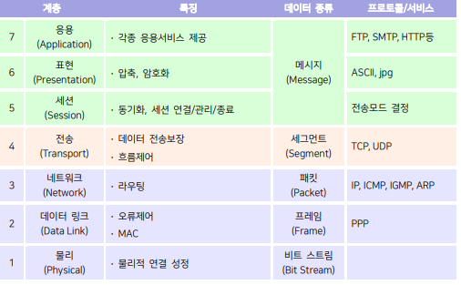
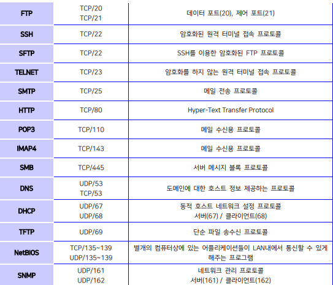
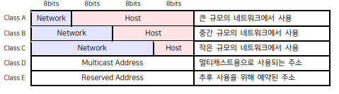
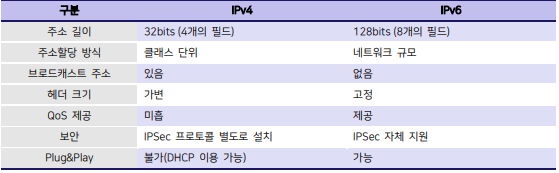
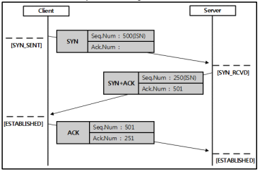
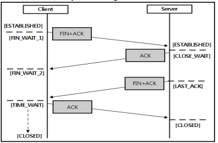

CH3. 네트워크의 이해
1. 네트워크 기초
    1-1. OSI 7계층
    # OSI 7계층 요약
    

    1-2 네트워크 장비
    # 허브(Hub)
        • 물리 계층에서 동작하는 장비
        • 더미 허브(Dummy Hub)
            - 일반적인 허브
            - 허브로 들어온 데이터를 모든 포트로 뿌려주는 역할
            - 충돌이 발생할 확률이 높고, 연결된 노드가 많을수록 속도가 저하됨

        • 스위칭 허브(Switching Hub)
            - 허브에 스위칭 개념을 도입한 장비
            - 허브로 들어온 데이터를 해당 목적지에 해당하는 포트로 전송함
            - MAC 주소를 이용하기 때문에 2계층 장비로 분류되고 충돌 도메인을 나누는 역할을 함
        
        • 리피터(Repeater)
            - 약해진 신호를 수신하여 원래의 형태로 재생하고 증폭하는 장비
            - 최근에는 모든 네트워크 장비에 기본적으로 들어가 있는 기능

        • 브리지(Bridge)
            - 데이터 링크 계층인 MAC에서 동작하는 장비
            - 네트워크를 확장시키고 통신을 격리시키기 위해 사용
            - 충돌 도메인(Collision Domain)을 나누는 역할을 함

        • 라우터(Router)
            - 3계층 장비로 물리/ 데이터 링크/ 네트워크 계층에서 동작
            - 라우터는 각 인터페이스마다 MAC 주소와 IP주소를 갖는다
            - 브로드캐스트 도메인(Broadcast Domain)을 나누는 역할을 함
        
        • 게이트웨이(Gateway)
            - 서로 다른 프로토콜을 사용하는 네트워크를 상호 접속하기 위한 장비
            - 4계층 장비로 분류된다

    1-3. 이터넷/LAN의 기본 이해
    # 토폴로지(topology)에 따른 분류
        • 그물(mesh)형 토폴로지
            - 모든 장치들끼리 점-대-점 링크를 갖는다 -> 많은 링크가 필요
            - 통신량 문제를 해결, 안정성/보안성 향상

        • 스타형(성형) 토폴리지
            - 각 장치들은 허브라고 불리는 중앙제어장치와 점-대-점 링크를 갖는다.
            - 그물형토폴로지보다 비용 낮음, 설치/재구성 용이
        
        • 버스형 토폴로지
            - 하나의 긴 케이블이 네트워크 상의 모든 장치를 연결하는 형태 -> 적은 양의 링크 수
            - 설치가 용이하지만 재구성/결합 분리는 어려움
        
        • 링형 토폴로지
            - 자신의 양쪽에 있는 장치와 점-대-점 링크를 갖고, 각 장치는 중계기를 포함
            - 비교적 설치/재구성이 용이하지만 장치 추가가 어렵고 단방향 전송의 단점을 갖는다

    # 규모에 따른 분류
        • LAN(Local Area Network)
            - 근거리 통신망, 단일 건물 같은 소규모 지역을 묶는 네트워크

        • MAN(Metropolitan Area Network)
            - LAN보다 크고 WAN 보다는 작은 규모의 네트워크
            - 하나의 도시 정도르 묶는 네트워크

        • WAN(Wide Area Network)
            - 광역 통신만
            - 하나의 국가 정도를 묶는 네트워크

    1-4. TCP/IP 및 네트워크 프로토콜의 이해
    # 프로토콜(Protocol) 과 포트(Port)
        • 프로토콜
            - 컴퓨터 간의 통신을 위한 규격
            - /etc/protocols 에서 주요 프로토콜 번호를 확인할 수 있다.

        • 포트번호
            - 포트: TCP와 UDP에서 어플리케이션의 상호 통신을 사용
            - OSI 계층의 4계층(전송계층)에서 사용되는 논리적인 주소
            - 0~65535번의 범위(2^16) 중에서 0~1023번 까지는 특정 프로토콜이 지정되어 있으며, 잘 알려진 포트(well-known prot)라고 한다
            - /etc/services에서 주요 포트 번호를 확인할 수 있다.

        • 주요 포트 번호
        

        # IP(internet Protocol)
            • IP 주소: OSI 7계층의 3계층(네트워크 계층)에서 사용되는 논리적인 주소
            • 32bits의 길이를 가지며, 네트워크 ID와 호스트 ID로 구성되어 있다.
            • 클래스(class)
        

        • 예약된 주소
            - 0.0.0.0/32: 현재 네트워크를 뜻하는 주소로, 자신의 IP 주소를 모를 때 사용
            - 10.0.0.0/8: A 클래스의 사설 주소
            - 127.0.0.0/8: 루프백(loopback) 주소
            - 172.16.0.0/12: B 클래스의 사설 주소
            - 192.168.0.0/16 : C 클래스의 사설 주소
            - 255.255.255.255/32 : 브로드캐스트 주소, 같은 네트워크 상의 모든 장치에게 패킷을 전송할 때 사용

        • 서브네팅(Subnetting)
            - IPv4 주소의 고갈로 인해 하나의 네트워크를 여러 개의 서브 네트워크로 나누어 낭비를 막기위한 방법
            - 서브넷 마스크(Subnet mask): IP 주소를 네트워크 주소와 호스트 주소로 구분하기 위한 주소

        • IPv6
            - IPv4 주소의 고갈로 더 큰 주소 길이를 갖는 IPv6 주소 체계가 등장
            - 크게 확장된 주소 공간, 향상된 서비스, 보안성 향상
            - IPv4 vs IPv6
            
        
        • ARP 프로토콜
            - IP주소를 이용해 해당 MAC 주소를 요청하는 프로토콜
            - 보통은 3계층 프로토콜로 분류된다(2계층으로도 분류되는 경우도 있음)
            - RARP: MAC 주소를 이용해 IP 주소를 요청하는 프로토콜

    # TCP(Tranmission Control Protocol)
        • 신뢰적이고 연결지향적인 프로토콜
        • 전이중(full-duplex) 통신: 동시에 양방향 전달 가능
        • 연결 설정 과정(3-way-Handshaking)
        

        • 연결 종료 과정(4-way-Handshaking)
        

    2. 네트워크 설정
    2-1. 환경 설정
    # IP 주소 설정
        • LAN 카드를 OS에 인식시킨 후 IP를 설정해야 한다
        • ifconfig 명령어
            - 형식: #ifconfig [인터페이스 명] [옵션]
            - [-a]: 시스템의 전체 인터페이스에 대한 정보를 클릭
            - 옵션 없이 사용 시 현재 설치된 네트워크 인터페이스의 설정 내용을 출력
            - IP주소, 서브넷 마스크, 브로드캐스트 주소, MAC 주소, MTU, RX/TX 패킷등의 정보를 알 수 있다.
            EX) IP 설정 예제
                # ifconfig eth0 192.168.1.33 netmask 255.255.255.0 → eth0 인터페이스에 IP, 넷마스크 설정
                # ifconfig eth0 up → eth0 인터페이스 활성화 

        • IP 명령어
        - [addr] : 네트워크 인터페이스에 대한 정보를 출력(show) / 추가(add) / 삭제(del)
            EX) # ip addr show → 인터페이스 정보 출력
                # ip addr add 192.168.1.33/24 dev eth0 → eth0 인터페이스에 IP 설정
                # ip addr del 192.168.1.33/24 dev eth0 → eth0 인터페이스에 설정된 IP 삭제
        
        - [route] : 라우팅 테이블 출력(show) / 정적 라우팅 추가(add) / 삭제(del)
            EX) # ip route show → 라우팅 테이블 출력
                # ip route add 10.90.21.1/24 via 192.168.1.33 dev eth 0 → eth0 인터페이스에 대한 정적 라우팅 추가
                # ip route del 10.90.21.1/24 → 정적 라우팅 삭제
                # ip route add default gateway 192.168.1.1 → 디폴트 게이트웨이 추가
        
        - [link] : 네트워크 인터페이스 상태 출력(show) / 관리(set)
            EX) # ip link show → 인터페이스 상태 출력
                # ip link set eth0 up → eth0 인터페이스 활성

    2-2. 네트워크 관련 명렁어
    # netstat 명령어
        • 네트워크 상태 정보를 출력하는 명령어
        • 주요 옵션
            - [-a]: 모든 소켓 정보 출력
            - [-r]: 라우팅 정보 출력
            - [-n]: 호스트 이름을 IP 주소로 출력
            - [-l]: LISTEN 상태인 소켓 정보만 출력
            - [-p]: 해당 소켓과 관련된 프로세스의 이름과 PID 출력
            - [-t]: TCP 프로토콜만 출력
            - [-u]: UDP 프로토콜만 출력

    # 네트워크 상태 진단 명령어
        - traceroute 명령어: 목적지까지 패킬이 지나가는 경로를 출력
        - ping 명령어: 목적지에 ICMP 패킷(echo_request)을 보내 상태를 점검

    # DNS 관련 명령어
        • nslookup 명령어: DNS 서버와 질의/응답하는 명령어
        • dig 명령어: nslookup 명령어와 비슷하지만 더 간결하고 사용하기 편리
        • 관련 파일
            - /etc/resolv.conf 파일: 네임서버가 정의되어 있는 파일
            - /etc/hosts 파일: 도메인/호스트명과 IP 주소 매핑 정보를 저장하고 있는 파일

    # route 명령어
        • 라우팅 테이블을 출력/수정 하는 명령어
        • 주요 옵션
            - [add]: 라우팅 경로나 디폴트 게이트웨이를 추가
            - [del]: 라우팅 경로나 디폴트 게이트웨이를 삭제
            - [-n]: 호스트 이름을 IP 주소로 출력
        • 옵션 없이 사용시 라우팅 테이블을 출력

    # nmcli 명령어
        • 네트워크 관리자(Network Manager) 서비스를 커맨드라인에서 수행하는 명령어
        • 주요 옵션
            - [con show]: 네트워크의 모든 연결에 대한 정보를 출력
            - [con add]: 네트워크 연결 설정 추가
                EX) # nmcli con add con-name ens33 ifname test-net type eth ip4 192.168.1.33/24 gw4 192.168.1.1 
            - [con del]: 네트워크 연결 설정 제거
            - [con up]: 네트워크 연결 활성화
            - [con mod]: 네트워크 연결 설정 수정