CH4. 일반 운영 관리
1. 사용자 관리
    1-1. root 사용자 관리
    # su 명령어 
        • 다른 사용자로 전환하는 명령어 
        • 주요 옵션
            - [-]: 전환하는 사용자의 초기화 파일을 실행
                EX) #su-root -> root의 환경변수를 적용하고 전환
            - [-C]: 계정 변환 없이 특정 명령어만 실행(sudo 명령어와 같은 기능)
                EX) #su-c'cat/etc/passwd'-root -> root 권한으로 해당 명령을 실행
        • su 명령어로 사용자 전환 후의 위치는 동일

    # root 계정 관리
        - root 계정의 UID 값은 0이다.
        - root 이외에 UID가 0인 사용자가 없도록 해야 한다.
        - TMOUT 환경 변수를 사용해 일정시간 미사용시 자동으로 로그아웃 되도록 설정하여 보안을 강화한다.
        - 사용자 인증 모듈인 PAM을 이용해 root 계정으로의 직접 로그인을 차단한다
        - 일반 사용자에게 특정 명령어에 대한 root 권한이 필요할 때는 su 명령어보다는 sudo 명령어를      이용하도록 한다.

    1-2. 사용자 계정 관리
    # 계정 관리 관련 파일
        • /etc/passwd 파일
            - 파일 내용 구성
                [user_account]:[user_password]:[UID]:[GID]:[comment]:[home_directory]:[login_shell]
                1) user_account: 사용자 계정
                2) user_password: /etc/shadow 파일에 암호화되어 저장되어 있다
                3) UID: User ID. 보통 100번 이하는 시스템이 사용, 0번은 시스템 관리자를 나타낸다
                4) GID: Group ID
                5) comment
                6) home_directory: 로그인 성공 후에 사용자가 위치할 홈 디렉터리의 절대경로
                7) login_shell: 로그인 셀의 절대 경로

        • /etc/shadow 파일
            - 파일 내용 구성
                [user_id]:[encryption_pw]:[last_change]:[minlife]:[maxlife]:[warn]:[inactive]:[expires] 
                1) user_id : 사용자 계정 
                2) encryption_pw : 일방향 해시 알고리즘을 이용해 암호화한 패스워드 
                    - 형식 : $ id $ salt $ encrypted_password 
                    - id : 적용된 일방향 해시 알고리즘 (1 : MD5 / 5 : SHA-256 / 6 : SHA-512 등) 
                3) last_change : 마지막으로 패스워드를 변경한 날(1970.01.01.부터 지난 일수로 표시) 
                4) minlife : 최소 패스워드 변경 일수(패스워드를 변경할 수 없는 기간) 
                5) maxlife : 최대 패스워드 변경 일수(패스워드 변경 없이 사용할 수 있는 일수) 
                6) warn : 경고 일수(maxlife 필드에 지정한 일수가 얼마 남지 않았음을 알림) 
                7) inactive : 최대 비활성 일수 
                8) expires : 계정이 만료되는 날(1970.01.01.부터 지난 일수로 표시)

            - encryption_pw 필드의 기호 뜻
            

        • /etc/login.def 파일
            - 사용자 계정의 설정과 관련된 기본 값을 정의한 파일
            - 기본 메일 디렉터리, 패스워드 에이징, 사용자 계정의 UID/GID 값 범위 등의 기본값을 설정할 수 있다.
        
        • /etc/skel 디렉터리
            - 사용자 계정 생성 시 공통으로 배포할 파일이나 디렉터리를 저장하는 디렉터리

        • /etc/default/useradd 파일
            - useradd 명령어로 계정 생성 시 기본 값을 지정한 파일

    1-3. 그룹 계정 관리
    # 그룹 관리 관련 파일
        • /etc/group 파일
            - 파일 내용 구성: 그룹 명 : 그룹 패스워드 : GID : 그룹 멤버
            - /etc/passwd 파일에는 기본 그룹의 GID가 저장되고. /etc/group 파일에는 2차 그룹의 정보가 저장
        
        • /etc/gshadow 파일
            - 파일 내용 구성: 그룹 명 : 암호화 된 그룹 패스워드 : 관리자 : 그룹 멤버

    1-4. 관련 명령어
    # useradd 명령어
        • 사용자 계정을 생성하는 명령어
        • 주요 옵션
            -[-u]: UID 지정
            -[-o]: UID의 중복을 허용
            -[-g]: 기본 그룹의 GID 지정
            -[-G]: 2차 그룹의 GID 지정
            -[-d]: 홈 디렉터리 지정
            -[-s]: 기본 쉘을 지정
            -[-c]: 코멘트 지정
            -[-D]: 기본 값을 설정하거나 출력(/etc/default/useradd 파일 내용)
            -[-e]: 유효 기간 지정(/etc/shadow 파일의 expires 항목)
            -[-f]: 비활성 일수 지정(/etc/shadow 파일의 inactive 항목)
                EX) # useradd -u 500 -G 10 -s /bin/bash -e 2018-12-31 testuser → testuser 사용자의 UID는 500, GID가 10인 2차그룹, 기본 쉘은 bash, 유효기간은 2018-12-31 까지로 설정하여 생성 
        
        • 옵션 없이 계정 생성할 경우 패스워드를 설정하지 않았기 때문에 /etc/shadow 파일에 패스워드 항목이 !!로 지정되어 있다( 패스워드가 잠겨 있다는 기호)

    # usermod 명령어
        • 사용자 계정의 정보를 변경하는 명령어
        • 주요 옵션
            - useradd 명령어와 옵션이 동일
            - [-l]: 계정 이름 변경 
                    EX) # usermod -l usertest testuser → testuser 사용자의 이름을 usertest로 변경
    
    # userdel 명령어
        - 사용자 계정을 삭제하는 명령어
        -[-r] 옵션: 홈 디렉터리 제거
    
    # chage 명령어
        • 패스워드 에이징에 관한 설정을 하는 명령어
        • 주요 옵션
            - [-m] : /etc/shadow 파일의 minlife 항목 설정 (passwd -n) 
            - [-M] : /etc/shadow 파일의 maxlife 항목 설정 (passwd -x) 
            - [-W] : /etc/shadow 파일의 warn 항목 설정 (passwd -w) 
            - [-I] : /etc/shadow 파일의 inactive 항목 설정 (usermod -f) 
            - [-E] : /etc/shadow 파일의 expires 항목 설정 (usermod -e) 
    
    # passwd 명령어
        • 사용자 계정의 패스워드 변경/관리하는 명령어
        • 주요 옵션
            -[-n]: /etc/shadow 파일의 minlife 항목 설정
            -[-x]: /etc/shadow 파일의 maxlife 항목 설정
            -[-w]: /etc/shadow 파일의 warn 항목 설정
            -[-l]: 계정 잠금(lock)
            -[-u]: 계정 잠금 해제(unlock)
    
    # groupadd 명령어
        • 그룹을 생성하는 명령어
        • 주요 옵션
            -[-g]: GID 지정
            -[-o]: GID의 중복을 허용

    # groupmod 명령어
        • 그룹의 정보를 변경하는 명령어
        • 주요 옵션
            - groupadd 명령어와 옵션이 동일
            -[-n]: 그룹 이름 변경
    
    # groupdel 명령어
        • 그룹을 삭제하는 명령어

    # gpasswd  명령어
        • 그룹의 패스워드를 변경하거나 그룹에 계정을 추가/삭제하는 명령어
        • 주요 옵션
            -[-a]: 사용자 게정을 그룹에 추가
                EX) # gpasswd -a testuser testgroup → testgroup 그룹에 testuser 사용자를 추가 
            -[-d]: 사용자 계정을 그룹에서 삭제
            -[-r]: 그룹 암호를 삭제
            -[-A]: 그룹의 관리자를 지정
                EX) # gpasswd -A testuser testgroup → testgroup 그룹의 관리자를 testuser 사용자를 관리자로 설정

    # newgrp 명령어
        - 계정의 소속 그룹을 변경하는 명령어
            EX) # newgrp grp01 → grp01로 그룹을 변경 

    # 사용자 정보 확인 명령어
        (예제는 fedora, fedora2 사용자가 로그인 중인 상태에서 fedora 사용자가 명령 수행) 
        • who 명령어: 현재 시스템을 사용하는 사용자의 정보를 출력하는 명령어
            -[-q]: 사용자의 이름만 출력
            -[-H] : 출력 항목의 제목도 함께 출력 (Header) 
            -[-b] : 마지막으로 재시작한 날짜와 시간을 출력 (boot) 
            -[-r] : 현재 런레벨을 출력 (runleve)
            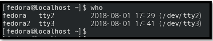
        
        • w 명령어
            - 현재 시스템을 사용하는 사용자의 정보와 작업 정보를 출력하는 명령어
            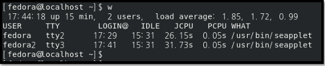

        • whoami 명령어
            - 현재 작업하고 있는 자신의 계정을 출력
            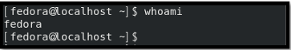
        
        • id 명령어
            - 현재 작업하고 있는 자신의 계정명, 그룹명, UID, GID를 출력하는 명령어

        • users 명령어
            - 현재 로그인 되어 있는 사용자의 계정을 출력
            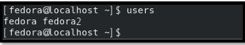

        • groups 명령어
            - 사용자 계정이 속한 그룹을 출력

        • lslogins 명령어
            - 시스템 내에 있는 사용자 게정에 대한 정보를 출력
            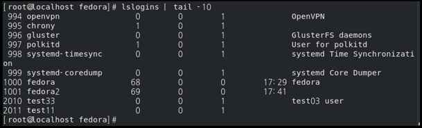
        
    # 무결성 검사 명령어
        • pwck 명령어
            - /etc/passwd 파일과 /etc/shadow 파일 내용의 무결성을 검사하는 명령어
            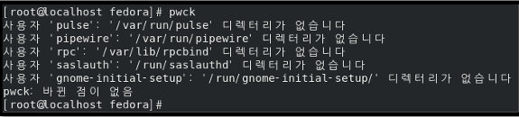
        
        •  grpck 명령어
            - /etc/group 파일과 /etc/gshadow 파일 내용의 무결성을 검사하는 명령어

    2. 파일 시스템 관리
    2-1. 파일 및 디렉터리 관리
    # ls -l 명령어 수행 시 각 필드 항목
    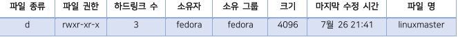

    # 파일의 종류
        • "ls -l" 명령어 사용 시 첫번째 필드의 첫번째 비트
        • 일반 파일: "-" 로 표기
        • 디렉터리(directory): "d"로 표기
        • 심벌릭링크 파일: “l”로 표기
            -  ln 명령어 : 링크 파일 생성 명령어

        - 옵션 없이 수행 시 하드링크 파일 생성, [-s] 옵션 사용 시 심벌릭링크 파일 생성 
            - 하드링크 : inode number가 같음. 복사 개념 
            - 심벌릭링크 : inode number가 다름. 바로가기 개념 
            EX) # ln -s file.txt file.txt.sl → file.txt의 심벌릭링크 파일로 file.txt.sl 을 생성 
        • 블록 장치 파일(/dev/hda, /dev/fd0 등) : “b” 로 표기 
        • 문자 디바이스 파일(입출력 장치) : “c” 로 표기 
 
    # 파일의 권한(Permission) 
        • “ls -l” 명령어 사용 시의 첫번째 필드에서 첫번째 비트를 제외한 9개 비트 
        • 소유자(owner) / 그룹(group) / 기타 사용자(others) 순으로 표기 
            EX) # ls -l 
                drwxr-xr-x  …  directory → directory 파일은 디렉터리이며 소유자에 대해 모든 권한을 부여하며, 그룹/기타 사용자 에게는 읽기와 실행 권한만 부여 
            
                -rw-r—r--  …  file.txt → file.txt 파일은 일반 파일이며 소유자에 대해 읽기와 쓰기 권한을 부여하며, 그룹/기타 사용자 에게는 읽기 권한만 부여 
    
        • 특수 접근 권한 
            - SetUID : 이 권한이 있는 파일을 실행하는 동안에는 파일 소유자의 권한으로 실행되도록 함. 
                EX) -rwsr-xr-x  1  root  root  …  /bin/passwd → passwd 명령어를 실행하는 동안은 root 권한으로 동작 
            - SetGID : 이 권한이 있는 파일을 실행하는 동안에는 파일 소유 그룹의 권한으로 실행되도록 함. 
            - Sticky bits : 이 권한이 있는 디렉터리에는 누구나 파일을 생성할 수 있다. (삭제는 소유자와 root만 가능) 
                EX) drwxrwxrwt  16  root  root  …  /tmp → tmp 디렉터리에는 누구나 파일을 생성할 수 있음. 
 
        • umask 명령어 
            - 기본 접근 권한을 출력/변경하는 명령어 
                EX) # umask 022 → 그룹, 기타 사용자에게는 쓰기 권한을 부여하지 않도록 기본 접근 권한 설정 
            - 일반 파일의 최대 접근 권한은 666이고, 디렉터리의 최대 접근 권한은 777이다. 
            - umask가 022일 때 파일을 생성한 직후의 권한은 644이고, 디렉터리를 생성한 직후의 권한은 755이다. 
 
    # 권한/소유권 변경 관련 명령어 
        • chown 명령어  
        - 파일과 디렉터리의 소유자와 소유 그룹을 변경하는 명령어 
        - [-R] : 서브 디렉터리의 소유자와 소유 그룹도 같이 변경 
            EX) # chown fedora2 /linuxmaster/fedora.txt → fedora.txt 파일의 소유자를 fedora2로 변경 
                # chown fedora2:grp01 /linuxmaster/fedora.txt → fedora.txt 파일의 소유자를 fedora2로, 소유 그룹을 grp01로 변경 
        • chgrp 명령어 : 파일과 디렉터리의 소유 그룹을 변경하는 명령어 
        • chmod 명령어 
            - 파일과 디렉터리의 접근권한을 변경하는 명령어 
            - [-R] : 서브 디렉터리의 접근권한도 모두 변경 
            EX) # chmod 644 perm.tmp → perm.tmp 파일의 접근권한을 644(rw-r—r--)로 변경 
                # chmod go-rwx perm.tmp → perm.tmp 파일의 접근권한에서 그룹과 기타 사용자의 권한을 모두 제거 
 
    # 파일 속성 관련 명령어 
        •  파일 속성 기호 
            - a : 해당 파일에 추가만 가능 
            - c : 자동으로 압축된 상태로 저장 
            - d : dump로 백업이 되지 않음 
            - i : 해당 파일에 대해 변경/삭제 등을 할 수 없음 
            - u : 해당 파일이 삭제될 경우 그 내용이 저장이 되며, 데이터 복구가 가능 
        • lsattr 명령어 
            - 디렉터리/파일의 속성을 출력하는 명령어 
        • chattr 명령어 
            - 디렉터리/파일의 속성을 변경하는 명령어 
                EX) # chattr +i attr.tmp → attr.tmp 파일에 i 속성을 추가
    
    2-2. 파일 시스템 복구
    # /etc/fstab 파일
        • 파일 시스템의 마운트 설정 정보를 가지고 있는 파일
        • 파일 구조
        
            - 장치 이름에는 장치 파일명 외에도 UUID나 라벨명으로 설정 가능
        
        • 옵션 필드 종류
            - defaults : 기본 값. rw, nouser, auto, exec, suid 속성을 포함 
            - auto : 부팅 시 자동으로 마운트 ↔ noauto 
            - exec : 실행 파일이 실행되는 것을 허용 ↔ noexec 
            - suid : SUID/SGID의 사용 허용 ↔ nosuid 
            - ro : 읽기 전용 ↔ rw : 읽기/쓰기 허용 
            - user : 일반 사용자도 마운트 가능 ↔ nouser : 일반 사용자의 마운트 불가능(root만 가능) 
            - usrquota : 사용자별로 디스크 쿼터 설정 허용 
            - grpquota : 그룹별로 디스크 쿼터 설정 허용 
        
        • 덤프 설정 
            - 1 : dump 등의 데이터 백업 명령어 사용으로 파일 시스템의 내용 덤프 가능 
            - 0 : 파일 시스템의 내용을 덤프 불가능 
        
        • 파일 점검 옵션 
            - 0 : 부팅 시 fsck 명령어로 파일 시스템 점검 미수행 
            - 1 : 루트 파일 시스템에 설정. 부팅 시 파일 시스템 점검 수행 
            - 2 : 루트 파일 시스템 이외의 파일 시스템 점검 수행 
 
    # mount 명령어 2014(1) 2016(1) 2016(2) 
        • 파일 시스템을 마운트하는 명령어 
        • 형식 : # mount [옵션] [장치 이름] [마운트 포인트] 
        • 주요 옵션 
            - [-t] : 파일 시스템 종류를 지정 
                EX) # mount -t iso9660 /dev/cdrom /mnt/cdrom → CD-ROM을 /mnt/cdrom 디렉터리에 마운트 
            - [-f] : 마운트가 가능한지 확인만 수행 
            - [-o] : 마운트 옵션을 지정 
                EX) # mount -t ext4 -o ro,user /dev/sdb /mnt → /dev/sdb 장치를 /mnt에 마운트. 읽기전용, 일반 사용자도 마운트할 수 있도록 허용 
                # mount -t iso9660 -o loop /linuxmaster/temp.iso /mnt/iso → temp.iso ISO 이미지를 /mnt/iso에 마운트 
        • 언마운트는 umount 명령어를 이용 
        • CD-ROM 장치 언마운트 후 CD를 꺼낼 때 eject 명령어를 이용 2018(1) 
 
    # fdisk 명령어 2016(2) 2017(1) 
        • 디스크의 파티션 생성/삭제, 정보 출력 등 파티션을 관리하는 명령어 
        • 주요 옵션 
            - [-l] : 파티션 테이블 출력 
        • 주요 내부 명령어 2014(1) 2014(2) 2016(1) 2018(1) 
            - d : 파티션을 삭제 
            - l : 사용 가능한 파티션 시스템 종류를 출력 
                * 주요 시스템 종류 : 82(linux swap), 83(linux), 8e(linux LVM) 2015(1) 2017(2) 
            - n : 새로운 파티션 생성 
            - p : 파티션 테이블 출력 
            - t : 파티션의 시스템 종류를 변경 
            - w : 파티션 정보를 디스크에 저장하고 종료 
 
    # 파일 시스템 생성(포맷) 명령어 
        • mkfs 명령어 
            - [-t] : 파일 시스템 종류 지정 (default : ext2) 
                EX) mkfs -t ext4 /dev/sdb1 → /dev/sdb1 파일 시스템을 ext4로 생성 
            - mkfs.ext2 / mkfs.ext3 / mkfs.ext4 명령어도 제공 
        • mke2fs 명령어 2014(1) 2016(1) 
            - [-t] : 파일 시스템 종류 지정 (default : ext2) 
            - [-c] : 배드블록을 체크 
            - [-b] : 블록크기를 바이트 수로 지정 
            - [-j] : ext3 형식으로 생성 (journaling) 
            - 기본 설정 값은 /etc/mke2fs.conf 파일에서 정의 
 
 
    # LVM(Logical Volume Manager) 2014(2) 
        • 독립적으로 구성된 디스크 파티션을 하나로 연결하여 한 파티션처럼 사용할 수 있도록 해주는 관리도구 
        • 관련 용어 2018(1) 
            - PV(Physical Volume) : 실제 하드디스크의 파티션을 의미 
            - VG(Volume Group) : 여러 개의 PV를 그룹으로 묶은 것을 의미 
            - LV(Logical Volume) : VG를 다시 적절한 크기로 나눈 파티션을 의미 
            - PE(Physical Extent) : PV가 가진 일정한 블록을 의미 
            - LE(Logical Extent) : LV가 가진 일정한 블록을 의미 
        • 주요 명령어 (LVM 생성 시 사용 순) 
            1) 해당 파티션의 종류 변경  
            - fdisk → t → 기존 83(linux) 를 8e(linux LVM)로 변경 
            2) PV 생성 
            - pvcreate 명령어 
            - pvscan 명령어 : PV 상태를 확인 
            3) VG 생성 : vgcreate 명령어 
            4) VG 활성화 
            - vgchange -a y : 활성화 
            - vgchange -a n : 비활성화 
            - vgdisplay -v : VG 상태 확인 
            5) LV 생성 
            - lvcreate 명령어 
            - lvscan 명령어 : LV 상태 확인 
            6) LV에 파일 시스템 생성 : mkfs / mke2fs 명령어 사용 
            7) LV 마운트 : mount 명령어 사용 
    
    # 파일 시스템 점검/복구 관련 명령어 
        • fsck 명령어 
            - 파일 시스템을 검사/복구하는 명령어 
            - [-f] : 강제 검사 
            - [-b] : 지정한 백업 슈퍼블록을 사용하여 복구 
            - fsck.ext2 / fsck.ext3 / fsck.ext4 명령어도 제공 
        • e2fsck 명령어 
            - 파일 시스템을 점검하기 전에 해당 파일 시스템을 umount 후 진행 
            - [-j ext3/ext4] : ext3나 ext4 파일 시스템을 검사할 때 지정 
        • badblocks 명령어 
            - 지정한 장치의 배드 블록을 검사하는 명령어 
            - [-v] : 검사 결과 자세히 출력 
            - [-o] : 검사 결과를 지정한 출력 파일에 저장 
        • tune2fs 명령어 
            - ext2 파일 시스템을 설정(튜닝)하는 명령어 
            - [-i] : ext2 파일 시스템을 ext3 파일 시스템으로 바꿈 
            - [-l] : 파일 시스템 슈퍼 블록 내용을 출력 
    
    # 새로운 디스크 추가 과정 
        1. 새로운 디스크 설치 
        2. 파티션 생성 : fdisk 명령어 
        3. 파일 시스템 생성 : mkfs / mke2fs 명령어 
        4. 마운트할 디렉터리(마운트 포인트) 생성 
        5. 파일 시스템 마운트 : mount 명령어
    
    2-3. 관련 명령어
        # ls 명령어 
        • 주요 옵션
            -[-a] : 숨겨진 파일을 포함한 모든 파일의 목록을 출력
            -[-d] : 지정한 디렉터리 자체의 정보를 출력
            -[-i] : inode 번호를 출력 
            -[-l] : 파일의 상세한 정보를 출력 
            -[-A] : .(현재 디렉터리), ..(이전 디렉터리)를 제외하고 출력 
            -[-F] : 파일의 종류를 함께 출력 (* : 실행파일, / : 디렉터리, @ : 심벌릭 링크) 
            -[-L] : 심벌릭 링크 파일의 원본 파일 정보를 함께 출력 
            -[-R] : 하위 디렉터리들의 파일 목록까지 함께 출력

        •  grep 명령어와 조합 
            - 디렉터리만 출력 
            # ls -al | grep “^d” 
           
            - 일반 파일만 출력 
            # ls -al | grep “^-“ 
            # ls -al | grep -v “^[a-zA-Z]” 
          
            - 특정 문자열이 들어간 파일 검색
            # ls -al | grep linux
    
    # 디스크 사용량 출력 명령어
    • df 명령어
        - 파일 시스템별 디스크 사용량을 확인하는 명령어
        -[-a] : 모든 파일시스템의 디스크 사용량을 출력 
        -[-h] : 디스크 사용량을 알기 쉬운 단위로 출력 
        -[-t] : 지정한 파일 시스템에 해당하는 디스크 사용량을 출력 
        -[-T] : 파일 시스템의 종류도 함께 출력 
        -옵션 없이 사용 시 vs [-h] 옵션 사용 시 비교
        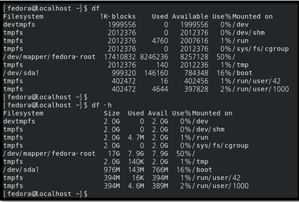
    
    • du 명령어
        - 디렉터리나 사용자 별로 디스크 사용량을 확인하는 명령어 
        - 형식 : # du [옵션] [디렉터리] 
        - [-s] : 특정 디렉터리의 전체 사용량을 출력 
        - [-h] : 디스크 사용량을 알기 쉬운 단위로 출력 
        - [-d NUM] : (--max-depth=NUM) 현재 디렉터리 기준으로 하위 NUM 단계 아래의 디렉터리까지의 디스크 사용량 출력 
        - 옵션 없이 사용 시 현재 디렉터리의 디스크 사용량을 출력 

    # 디스크 사용량(quota) 관련 명령어 
    • 쿼터 설정 전에 /etc/fstab 파일의 옵션 필드에 쿼터 관련 설정을 해주어야 한다. 
    • quotacheck 명령어 
        - 쿼터 파일을 생성/확인/수정을 위해 파일 시스템을 검사하는 명령어 
        - [-a] : 전체 파일 시스템 검사 
        - [-u] : 사용자 쿼터 확인 
        - [-g] : 그룹 쿼터 확인 
        - [-m] : 파일 시스템을 다시 마운트하지 않는다. 
        - [-v] : 자세하게 출력 
        EX) # quotacheck -avugm 
    
    • quotaon 명령어 
        - 파일 시스템의 쿼터 기능을 활성화하는 명령어 
        - [-a] : 전체 파일 시스템의 쿼터를 활성화 
        - [-u] : 사용자 쿼터 활성화 
        - [-g] : 그룹 쿼터 활성화 
        - [-v] : 자세하게 출력 
        EX) # quotaon -augv 
    
    • edquota 명령어 2017(2) 
        - 쿼터를 설정하는 명령어 (vi 형식) 
        - [-u] : 사용자 쿼터 설정 
        EX) # edquota -u fedora → fedora 유저의 쿼터 설정 
        - [-g] : 그룹 쿼터 설정 
        - [-p] : 쿼터 설정 복사 
        EX) # edquota -p fedora fedora2 → fedora 유저의 쿼터 설정 내용을 fedora2 유저에게 적용  
    
    • setquota 명령어 2016(2) 
        - 쿼터를 설정하는 명령어 (커맨드 라인에서 옵션으로 설정하는 형식) 
        - 형식 : # setquota [옵션] [이름] [block soft limit] [block hard limit] [inode soft limit] [inode hard limit] [장치명] 
        EX) # setquota -u fedora 1000 1100 0 0 / 
    
    • quota 명령어 
        - 쿼터 정보를 출력하는 명령어 
        - [-u], [-g] 옵션 포함 
        EX) # quota -u fedora → fedora 유저의 쿼터 설정 내용 출력 
    
    • repquota 명령어 
        - 쿼터 정보를 요약하여 출력하는 명령어 
        - [-a], [-u], [-g] 옵션 포함 
        - [-v] : 사용량이 없는 쿼터의 정보 출력

    # 파일 시스템 ACL(Access Control List) 관련 명령어
    • getfacl 명령어 
        - 접근 권한을 확인하는 명령어
        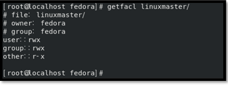
    
    • setfacl 명령어
        - 접근 권한을 설정하는 명령어 
        - [-m] : 권한을 수정 
        - [-x] : 권한을 삭제 
        - [-R] : 하위 디렉터리의 권한까지 변경
    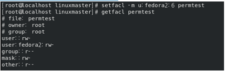

    # 스왑 영역 관련 옵션
    • 스왑(swap) : 1 페이지 참고 
    • mkswap 명령어 
        - 스왑 영역을 생성하는 명령어 
        - [-c] : 스왑 영역을 만들기 전에 먼저 배드블록을 검사 
    • swapon / swapoff 명령어 
        - 스왑 영역을 활성화/비활성화 하는 명령어 
    • dd 명령어 
        - 블록 단위로 파일을 복사/변환하는 명령어 
        - [if=FILE] : 지정한 파일을 입력으로 받는다 
        - [of=FILE] : 지정한 파일을 출력으로 설정 
        - [bs=BYTES] : 한 번에 읽어 들이거나(read) 출력(write)할 바이트 수 지정 
        - [count=BLOCKS] : 지정한 블록 수만큼 복사 
        EX) # dd if=/dev/zero of=/swapfile bs=1024 count=1000 → 1024바이트씩 1000번을 /dev/zero에 읽어서 /swapfile에 기록 
    • 스왑 파일 생성 절차 2014(2) 2015(1) 2016(1) 
        1) dd 명령어로 파일 생성 
        2) mkswap 명령어로 스왑 파일 생성 
        3) sync 명령어로 현재 메모리에 있는 데이터를 디스크에 저장 
        4) swapon 명령어로 스왑 영역 활성화 
    
    # parted 명령어 2017(2) 
    - 파티션 생성, 삭제, 크기 변경 등의 파티션 관리를 위한 명령어

    3. 프로세스 관리
    3-1. 프로세스의 제어
    # 런레벨(Run Level) 분류
    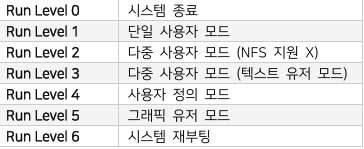

    # 포그라운드/ 백그라운드
        • 포그라운드(foreground): 포그라운드로 실행시킨 프로세스는 종료되기 전까지는 다른 작업을 할 수 없다.
        • 백그라운드(background): 프로세스를 백그라운드로 실행시키면 다른 작업 수행이 가능하다.
            - 명령어 마지막에 '&'를 붙여 실행하면 백그라운드로 실행시킬 수 있다.
    
    3-2. 관련 명령어
        # top 명령어
        • CPU 프로세스의 현황을 실기간으로 출력해주는 명령어
        • 주요 내부 명령어
            - l : 상단의 load average 항목 켜기/끄기 
        - t : 상단의 프로세스와 CPU 항목 켜기/끄기 
        - m : 상단의 메모리 항목 켜기/끄기 
        - M : 메모리 사용량이 큰 순서로 정렬 
        - P : CPU 사용량이 큰 순서로 정렬 
        - k : 입력한 PID의 프로세스 종료 
        - q : 종료 

    • 각 필드 설명 
        - PID : 프로세스 ID 
        - USER : 프로세스를 실행시킨 사용자 
        - PR : 프로세스 우선순위 
        - NI : NICE 값 
        - VIRT : 프로세스가 사용하는 가상 메모리 크기 
        - RES : 프로세스가 사용하는 메모리 크기 
        - SHR : 프로세스가 사용하는 공유 메모리 크기 
        - S : 프로세스의 상태 (S : Sleeping, 휴먼상태 / R : Running, 실행상태 / Z : Zombie, 좀비 프로세스 / … ) 
        - %CPU : 프로세스가 사용하는 CPU의 사용률 
        - %MEM : 프로세스가 사용하는 메모리의 사용률 
        - TIME+ : 프로세스가 CPU를 사용한 시간 
        - COMMAND : 실행된 명령어 
    
    # ps 명령어 
    • 현재 실행중인 작업의 사용자와 PID를 출력하는 명령어 
    • 주요 옵션 
        - [-a] : 모든 프로세스 출력 
        - [-e] : 해당 프로세스에 관련된 환경변수 정보를 함께 출력 
        - [-f] : 여러 항목들에 관한 내용을 출력 
        - [-u USERNAME|UID] : 지정한 사용자가 실행한 프로세스를 출력 
        - [-p PID] : 지정한 프로세스의 정보를 출력
    
    • 각 필드 설명 
        - PID : 프로세스 ID 
        - PPID : 부모 프로세스 ID 
        - TTY : 프로세스와 연결된 터미널 포트 
        - C : 프로세스가 사용하는 CPU의 사용률 
        - STIME : 프로세스가 시작된 시간 
        - STAT : 프로세스의 상태 (top 명령어의 S 필드와 같다)

    # pstree 명령어 2014(1) 2016(2) 
    - 실행 중인 프로세스를 트리형태로 출력하는 명령어 
    - 주요 옵션 
        - [-c] : 중복된 프로세스도 출력 
        - [-n] : PID를 기준으로 정렬하여 출력 
        - [-p] : PID도 같이 출력 
        - [-u] : UID도 같이 출력 
 
    # pgrep 명령어 2016(2) 
    • 지정한 패턴과 일치하는 프로세스에 대한 정보를 출력 
    • 주요 옵션 
        - [-x] : 패턴과 정확히 일치하는 프로세스 정보를 출력 
        - [-u] : 지정한 사용자에 대한 모든 프로세스 출력 
    • 출력되는 정보가 많지 않기 때문에 ps 명령어와 같이 사용된다. 
    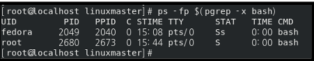

    # 프로세스 종료 명령어 
    • kill 명령어 
        - 프로세스에 시그널을 전송하는 명령어 
        - 형식 : # kill [시그널] [PID] 
        - 옵션을 지정하지 않으면 15번 시그널로 간주되어 실행된다. 
        - 주요 시그널 : 13 페이지 참고 
        - pgrep 명령어를 이용하면 pkill/killall 명령어와 같은 효과를 볼 수 있다. 
        EX) # kill `pgrep sleep` 
            # kill $(pgrep sleep) 
            # killall sleep → 전부 같은 결과를 나타낸다. 
    
    • pkill 명령어 
        - kill 명령어와 역할이 같지만 PID 대신 해당 명령어의 프로세스를 종료하는 명령어 
        - kill 명령어는 지정한 PID의 프로세스 하나만 종료되지만, pkill 명령어는 지정한 명령어에 관련된 여러 프로세스들이 한꺼번에 종료된다. 
    
    • killall 명령어  
        - pkill 명령어와 기능이 같다.

    # 우선순위 관련 명령어 
    • nice 명령어 2014(2) 2015(2) 2017(2) 
        - 지정한 프로세스의 우선순위(top 명령어의 NI 값)를 조정하는 명령어 
        - [-n] 옵션으로 우선순위를 조정할 수 있다. 
            EX) # nice -n 15 top → top 명령어의 우선순위를 15 증가 
        - 옵션없이 실행 시 지정한 프로세스의 우선순위를 10 증가시킨다. 
        - nice 명령어로 우선순위를 조정하면 새로운 프로세스가 추가된다. 
        - 우선순위 범위는 -20 ~ 19 사이의 값으로, 우선순위 값이 작을수록 우선순위가 높다. 
        - 우선순위 값을 낮추는 것(우선순위가 높아지는 것)은 root 만 가능하고 일반 계정은 우선순위 값을 높이는 것만 가능하다. 
    
    • renice 명령어 2016(1) 2017(2) 
        - 지정한 PID/UID/GID의 우선순위를 지정하는 명령어 
        - [-u UID|USERNAME] : 지정한 UID 또는 사용자의 모든 프로세스의 우선순위를 지정 
        - [-g GID] : 지정한 GID의 모든 프로세스의 우선순위를 지정 
        - [-p PID] : 지정한 PID의 우선순위를 지정 
        - nice 명령어와 다르게 지정한 우선순위의 값이 바로 설정되고, 새로운 프로세스가 추가되지 않는다. 
            EX) # renice 10 -u fedora → fedora 사용자의 모든 프로세스의 우선순위를 10으로 지정 
    
    # 백그라운드 작업 관련 명령어 
    • jobs 명령어 2014(1) 2017(1) 
        - 백그라운드 작업을 출력하는 명령어 
        - [-l] : 작업의 PID도 같이 출력 
        - [-p PID] : 해당 PID의 작업을 출력 
        - [-r] : Running 상태의 작업만 출력 
        - [-s] : Stopped 상태의 작업만 출력 
        - %[작업번호] 로 해당 작업의 정보만 출력할 수 있다. 
        - 작업번호 뒤에 기호 ‘+’는 가장 최근에 접근한 작업을 의미하고 ‘-‘는 ‘+’ 작업 바로 이전에 접근한 작업을 의미
    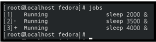

    • nohup 명령어 2014(2) 2015(2) 
    - 로그아웃한 후에도 백그라운드에서 작업을 계속 실행하도록 하는 명령어 
    - 형식 : # nohup [명령어] & 
      EX) # nohup find / -name shell & → ‘find / -name shell’ 명령어를 백그라운드로 작업을 계속 실행하도록 함 
     
    • fg / bg 명령어 2014(2) 2017(1) 2017(2) 
        - 지정한 작업번호에 대한 작업을 포그라운드 / 백그라운드 실행으로 옮기는 명령어 
        EX) # bg %3 → jobs 명령어로 확인한 작업번호 3의 작업을 백그라운드로 실행하도록 함 
        - 작업번호 지정없이 실행 시 가장 최근 작업에 대해 명령을 실행 
    
    
    # 작업 예약 관련 명령어 
    • at 명령어 
        - 지정한 시간에 지정한 명령을 한번만 실행하는 명령어 
        - [-l] : 예약 중인 명령어 목록을 출력 = atq 명령어와 같은 기능 
        - [-r] : 지정한 예약된 작업을 삭제 = atrm 명령어와 같은 기능 
        - 접근제어 파일 : /etc/at.allow, /etc/at.deny (at.allow 파일 우선) 

    • crontab 명령어 2014(2) 2015(1) 2016(1) 2016(2) 2017(1) 2017(2) 2018(1) 
        - 지정한 시간에 지정한 명령어를 주기적으로 실행하는 명령어 
        - [-e] : 사용자의 crontab 파일을 편집 
        - [-l] : crontab 파일의 목록을 출력 
        - [-r] : crontab 파일을 삭제 
        - crontab 파일 형식 : [분] [시] [일] [월] [요일] [작업내용] 
            EX) 30 20 1 * * /usr/bin/ls -l ~fedora > ~fedora/cron.out → 매월 1일 20시 30분에 ‘ls -l ~fedora’ 명령의 실행 결과를 cron.out 파일에 저장한다. 
            0 12-22/2 * * 1 /usr/bin/ps -ef → 매주 월요일 12시부터 22시 정각 2시간마다 ‘ps -ef’ 명령어를 실행 
            */30 0-2 1 * * /usr/bin/ls -l ~guest > ~root/geust.out → 매월 1일 0시부터 2시까지 30분마다 ‘ls -l ~geust’ 명령의 
    
    실행 결과를 ~root/guest.out 파일에 저장한다.                                       
        - 접근제어 파일 : /etc/cron.allow, /etc/cron.deny (cron.allow 파일 우선)

    4. 소프트웨어 설치 및 관리
    4-1. 패키지를 통한 소프트웨어 설치
    # rpm 명령어
    • RPM : Redhat Package Manager의 약자로 레드햇에서 만든 패키지 관리 도구. 확장자가 rpm인 패키지를 관리 
    • RPM 패키지 이름 구성
    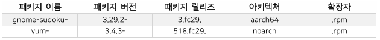

    • 주요 옵션
        1) 설치/업그레이드 관련 옵션 
            - [-i PACKAGE.rpm] : 패키지 설치 
            - [-U] : 패키지 업그레이드 
            - [-h] : 해시 기호(#)를 출력하여 진행도를 보기 쉽게 출력 
            - [-v] : 자세하게 출력 
            - [--replacepkgs] : 패키지가 설치가 되어있어도 강제로 설치 
            - [--replacefiles] : 패키지의 파일이 설치가 되어있어도 강제로 설치 
            - [--nodeps] : 의존성을 무시 
            - [--oldpackage] : 구버전으로 다운그레이드 
            - [--rebuilddb] : RPM 데이터베이스 업데이트 
            - [--force] : [--replacepkgs], [replacefiles], [oldpackage] 옵션을 같이 사용한 것과 동일 
        2) 질의 관련 옵션 → [-q] 와 같이 사용 
            - [-a] : 전체 패키지 목록 질의 
            - [-f FILE] : 지정한 파일이 속한 패키지 질의 
            - [-i] : 자세한 상세정보 질의 
            - [-p PACKAGE] : 지정한 패키지의 정보 질의 
            - [-l PACKAGE] : 지정한 패키지가 설치한 파일 목록 질의 
            - [-R PACKAGE] : 지정한 패키지의 의존성 질의 
        3) 삭제 옵션 
            - [-e PACKAGE] : 지정한 패키지 삭제 
        4) 검증 옵션 
            - [-V PACKAGE] : 지정한 패키지 무결성 검사 
            - 출력결과가 없으면 문제가 없는 것이다

        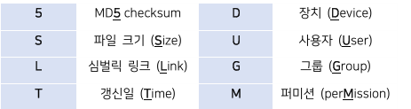

    • 사용 예제 
    # rpm -ivh gnome-sudoku-3.29.2-3.fc29.aarch64.rpm → gnome-sudoku 설치 
    # rpm -Uvh gnome-sudoku-3.29.2-3.fc29.aarch64.rpm → gnome-sudoku 업그레이드 
    # rpm -qa | grep gnome → 전체 패키지 목록 중에 gnome 문자열이 들어간 패키지 출력 
    # rpm -qf /usr/bin/gnome-sudoku → gnome-sudoku 파일이 어느 패키지에 속해 있는지 확인 
    # rpm -qi gnome-sudoku → gnome-sudoku 패키지의 상세 정보 출력 
    # rpm -e gnome-sudoku → gnome-sudoku 패키지 삭제 
 
    # yum 명령어 / dnf 명령어 
    • RPM 기반의 패키지 관리 도구 → 레드햇 계열 도구 
    • rpm 명령은 패키지 의존성을 확인하여 설치를 일일이 해주어야 하지만 yum 명령은 알아서 확인하여 설치까지 
    할 수 있도록 도와준다. 
    • DNF는 페도라 22 버전 이후부터 yum을 대체하는 패키지 관리자이다. 
    • 주요 옵션 
        - [list] : 설치된 전체 패키지 목록 출력 
        - [list all] : 이미 설치되었거나 설치 가능한 모든 패키지 목록 출력 
        - [list available] : 설치 가능한 모든 패키지 목록 출력 
        - [list updates] : 업데이트 가능한 패키지 목록 출력 ([list upgrades] 옵션과 같은 기능) 
        - [check-update] : 업데이트 가능한 패키지 목록 출력 ([check-upgrade] 옵션과 같은 기능) 
        - [list installed] : 설치된 패키지 목록 출력 
        - [install] : 지정한 패키지 설치 
        - [update] : 지정한 패키지 업데이트 ([upgrade] 옵션과 같은 기능) 
        - [info] : 지정한 패키지의 정보 출력 
        - [search] : 지정한 문자열이 들어간 패키지 검색 
        - [remove] : 지정한 패키지 삭제 
        - [-y] : 설치 과정의 모든 질문에 yes로 대답 
        - [-v] : 자세하게 출력 
    • yumdownloader 명령어 2018(1) 
        - yum 패키지를 설치하지 않고 rpm을 다운로드하는 명령어 
        - yum-utils 패키지에 포함 
    • yum 저장소 디렉터리 : /etc/yum.repos.d 2017(1) 
    
    # dpkg 명령어 2015(1) 2016(2) 2018(1) 
    • dpkg는 데비안의 패키지 관리 도구. 확장자가 deb인 패키지를 관리 
    • 주요 옵션 
        - [-i PACKAGE.deb] : 지정한 패키지 설치 (.deb 확장자를 가지는 패키지 전체 파일명으로 설치해야 함) 
        - [-l] : 설치된 전체 패키지 목록 출력 
        - [-L PACKAGE] : 지정한 패키지가 설치한 파일 출력 
        - [-I PACKAGE.deb] : (대문자 i) 지정한 패키지의 정보 출력 
        - [-P PACKAGE] : 지정한 패키지 삭제 
        - [-S FILE] : 지정한 파일이 속한 패키지 질의

    # apt 명령어 2015(1) 
    • APT(Advanced Packaging Tool)은 데비안 계열의 패키지 관리도구 
    • 주요 옵션 
        1) apt-get 명령어 옵션  
        - [install] : 지정한 패키지 설치 
        - [update] : 패키지 정보 업데이트 
        - [upgrade] : 설치되어 있는 모든 패키지를 업데이트 
        - [--reinstall] : [install] 옵션과 함께 사용하여 지정한 패키지 재설치 
            EX) # apt-get --reinstall install gnome-sudoku 
        - [remove] : 지정한 패키지 삭제 (설정파일은 삭제하지 않음) 
        - [--purge] : [remove] 옵션과 함께 사용하면 설정파일까지 모두 삭제 
            EX) #apt-get --purge remove gnome-sudoku 
        2) apt-cache 명령어 옵션 
        - [search] : 패키지 검색 
        - [show] : 지정한 패키지의 정보 출력 

    4-2. 소스 코드 컴파일
        # gcc 명령어
            • GNU의 C/C++ 컴파일러
            • 주요 옵션
                -[-o]: 출력 파일 저장
                -[-c]: 오브젝트 파일 생성(컴파일만 진행)
                -[-v]: 컴파일 과정을 자세하게 출력
                 EX) # gcc -o output.out source.c → source.c 파일을 컴파일하여 output.out 실행파일을 생성 
                     # gcc -c source.c → source.c 파일의 오브젝트 파일(source.o) 생성 
                     # gcc source.c → source.c 파일을 컴파일하여 실행파일을 생성(a.out) 
        
        # 소스파일로 된 패키지 설치하기
            •  configure 명령어
                - 제일 첫번째 단계로, 환경설정을 위한 스크립트
                - Markfile을 생성하는 단계이다

            • make 명령어
                - Makefile 파일에 설정된 정보를 읽어서 여러 개의 소스파일을 컴파일하고 링크하여 실행파일을 생성하는 명령어
                - 소스 파일을 컴파일 하기 위함

            • cmake 명령어
                - 멀티 플랫폼으로 사용할 수 있는 make의 대용품
                - make와 달리 유닉스 계열 뿐만 아니라 윈도우 계열의 프로그래밍 도구(Visual Studio 포함)도 지원

            • make install 명령어
                - 설치를 위한 명령어
                - make 명령어로 생성된 설치파일을 실행하기 위한 과정이다

            • 일반적인 과정 : configure → make → make install  
            • cmake 과정 : cmake → make install   

    # 아카이브/압축 관련 명령어 
    • tar 명령어 2014(1) 2014(2) 2015(1) 2015(2) 2017(1) 2017(2) 
        - 파일/디렉터리를 하나로 묶어 아카이브 파일을 생성 
        - [c] : 아카이브 파일 생성 
        - [x] : 아카이브 파일에서 원본파일을 추출 
        - [t] : 아카이브 파일의 내용 출력 
        - [r] : 기존 아카이브 파일에 새로운 파일/디렉터리 추가 
        - [u] : 아카이브 파일의 내용에 변동사항을 업데이트 
        - [v] : 처리중인 파일의 정보를 출력 
        - [f] : 아카이브 파일 지정 
        - [z] : gzip으로 압축하거나 해제 
        - [j] : bzip2로 압축하거나 해제 
        - [J] : .xz로 압축하거나 해제 
        EX) # tar cvf test.tar a.txt b.txt → a.txt 파일과 b.txt 파일을 test.tar 아카이브 파일로 묶음 
    # tar tvf test.tar → test.tar 파일의 내용 출력 
    # tar xvf test.tar → test.tar 파일의 원본 파일 추출 
    • gzip 명령어 
        - “.gz” 확장자 형태로 압축 
        - [-d] : 압축 해제 
        - [-l] : 압축 파일의 정보 출력 
        - [-v] : 압축 진행 과정을 출력 
        - [-9] : 압축률을 최대로 하여 압축 * 1~9까지 지정할 수 있으며 숫자가 클수록 압축률이 크지만 속도가 느리다. 
        - [-k] : 기존 파일을 유지하고 압축한다. 
        EX) # gzip -v test.tar → test.tar 파일 압축 
        - zcat 명령어 : .gz 로 압축된 파일의 내용을 출력 
        - gunzip 명령어 : .gz 로 압축된 파일의 압축 해제 
    • bzip2 명령어 
        - “.bz2” 확장자 형태로 압축 
        - gzip 명령어보다 압축률이 높지만 속도가 약간 느리다. 
        - gzip 명령어와 옵션이 동일 
        - bzcat 명령어 : .bz2 로 압축된 파일의 내용을 출력 
        - bunzip2 명령어 : .bz2 로 압축된 파일의 압축 해제 
    • xz 명령어 
        - “.xz” 확장자 형태로 압축 
        - 압축률이 가장 높은 명령어 
        - gzip, bzip2 명령어와 옵션이 동일 
        - xzcat 명령어 : .xz 로 압축된 파일의 내용을 출력 
        - unxz 명령어 : .xz 로 압축된 파일의 압축 해제 
    • zip 명령어 
        - “.zip” 확장자 형태로 압축 
        - 윈도우와 호환되는 압축파일 
        - 형식 : # zip [압축파일명.zip] [압축할 파일들] → 기존 압축 명령과 형식이 다름 
        - unzip 명령어 : .zip 으로 압축된 파일의 압축 해제 
    • compress 명령어 
        - “.Z” 확장자 형태로 압축 
        - uncompress 명령어 : .Z 로 압축된 파일의 압축 해제 
    • 압축 명령어들의 압축률 순서 2015(2) 
        - xz > bzip2 > gzip > compress
        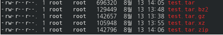